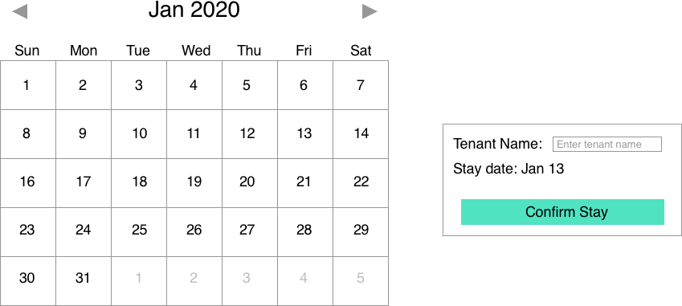
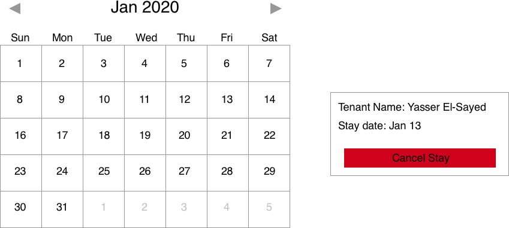

# Calendar Reserver

## Description

This assignment implements a simple calender reservation system where the user can reserve and cancel reservations for a single room. The front is built using **angular js** version@1.4 and the backend is implemented using express framework version @4.9. The calendar view is created using vanilla JS and bootstrap is used for styling

The following is a mockup for confirming a stay on the calendar.



The following is a mockup for cancelling a stay on the calendar.



## Getting Started

Install the package dependencies by running the following command:

For the client, navigate to frontend subdirectory

```
cd frontend
npm install
```

Once the dependencies are installed, you can start the client server by running

```
npm start
```

For the application (backend) server, navigate to backend subdirectory

```
cd backend
npm install
```

Once the dependencies are installed, you can start the application server by running

```
npm start
```

Once the server is running, you can start making requests to http://localhost:3000.

## Requests

The following is an example of some of the requests that can be made to the backend. The data in the backend is stored simply day by day in the format:

```
{
    "tennantName": "John Carson",
    "time": 1578394800
}
```

Where the `time` is a unix timestamp.

To get the reserved dates you have to pass the start timestamp and end timestamp in the url like so:

```
> Request
GET localhost:3000/reserve/1577790000/1609153200   HTTP/1.1
Accept: application/json

> Response
[
    {
        "tennantName": "Carson Rhodes",
        "time": 1578394800
    },
    {
    	"tennantName": "Giovanni Ferrell",
    	"time": 1581591600
    },
    {
    	"tennantName": "Orlando Hawkins",
    	"time": 1582887600
    }
]
```

To reserve a single date you need to pass in a date and a name and `reserve` with `true` (if you want to unreserve that, you have to pass it in with `false`):

```
> Request
POST localhost:3000/reserve   HTTP/1.1
Accept: application/json

{
	"tennantName": "Jimmy Carter",
	"time": 1578394800,
	"reserved": true
},

> Response
{
	"success": true
}
```

We've also added a helper request to get the current server time:

```
> Request
GET localhost:3000/now   HTTP/1.1
Accept: application/json

> Response
{
	"time": 1572117875
}
```

## Improvements

- Extend the calendar view to include leap years
- add a background color on the selected calendar box
- reserve multiple rooms in one go
